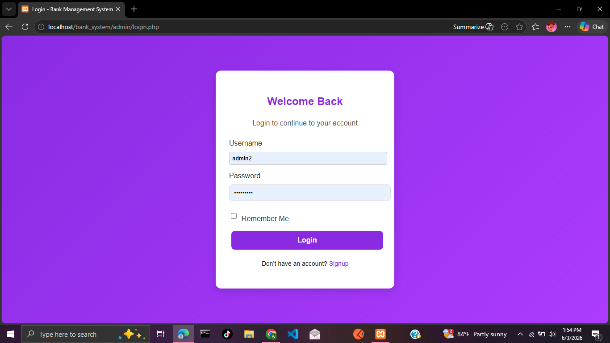
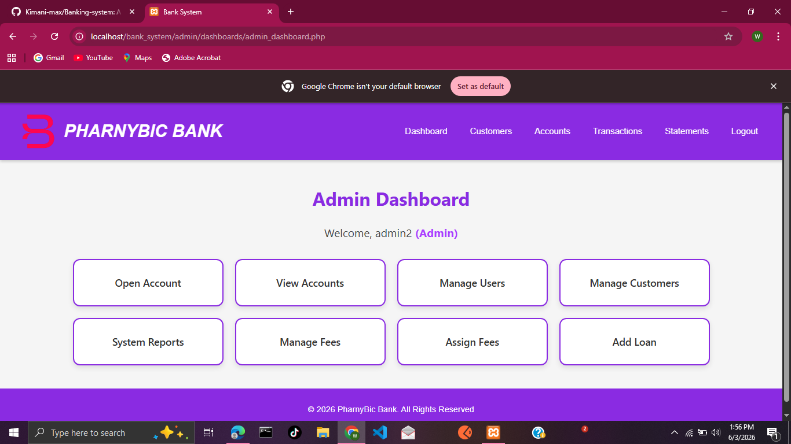
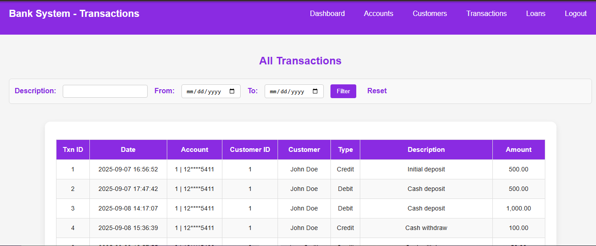

# 🏦 Banking System Project

A web-based Banking Management System developed using PHP and MySQL to simulate basic banking operations such as user management, account handling, and money transactions.

---

## 📌 Project Overview

This system allows administrators to manage users, create customer accounts, and perform banking transactions such as deposits, withdrawals, and transfers. It is designed to demonstrate real-world banking logic and database relationships.

---

## ⭐ Key Features

- 👤 User authentication (Login system)
- 👨‍💼 Customer management (Add, Edit, Delete)
- 💳 Account creation linked to customers
- 💰 Deposit and withdrawal functionality
- 🔁 Money transfer between accounts
- 📊 Transaction history tracking
- 🔐 Secure database relationships

---

## 🛠️ Technologies Used

- PHP (Backend logic)
- MySQL (Database)
- HTML (Structure)
- CSS (Styling)
- JavaScript (Basic interactivity)

---

## 🗄️ Database Structure

- users (user_id)
- customers (customer_id)
- accounts (account_id, customer_id)
- transactions (txn_id, account_id)

---

## 📷 Screenshots

> Add screenshots here to improve presentation

### 🔐 Login Page


### 📊 Dashboard


### 💳 Accounts Page


### 💰 Transactions


---

## 🧠 What I Learned

- Building relational database systems
- Implementing CRUD operations in PHP
- Managing financial transaction logic
- Handling foreign key relationships
- Structuring a full-stack web application

---

## ⚙️ Installation Guide

1. Clone the repository:
```bash
git clone https://github.com/your-username/banking-system.git
